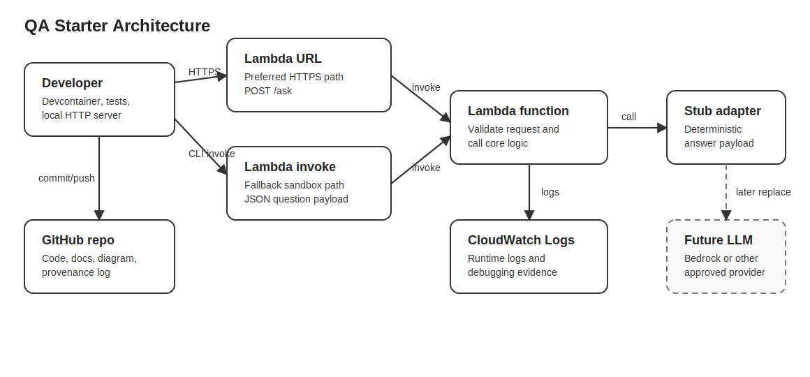

# Architecture Diagram

## Components

| Component | One-line description |
|---|---|
| Developer workstation / devcontainer | Reproducible development environment for running tests and the local HTTP prototype. |
| GitHub repository | System of record for source code, documentation, provenance log, and teammate onboarding instructions. |
| Local HTTP server | Standard-library development server that exposes the same `/ask` contract used by the cloud adapter. |
| AWS Lambda direct invoke | Sandbox-compatible invocation path that accepts a JSON question payload. |
| AWS Lambda Function URL | Preferred public HTTPS entry point when the Learner Lab AWS CLI and permissions support it. |
| AWS Lambda function | Stateless compute layer that validates the request and calls the QA generation boundary. |
| Stub model adapter | Deterministic placeholder response generator that will later be replaced by an approved LLM or RAG pipeline. |
| CloudWatch Logs | Operational log destination automatically used by Lambda for debugging sandbox runs. |
| Future model service | Planned integration point for Amazon Bedrock or another approved model provider. |

## Request flow

1. A caller sends a question either through `POST /ask` on the Lambda Function URL or through `aws lambda invoke` with a JSON payload.
2. The Lambda handler validates and normalizes the question through `core.py`.
3. The current stub model adapter returns a deterministic response.
4. The same generation boundary can later call a real model service without changing the external response contract.
